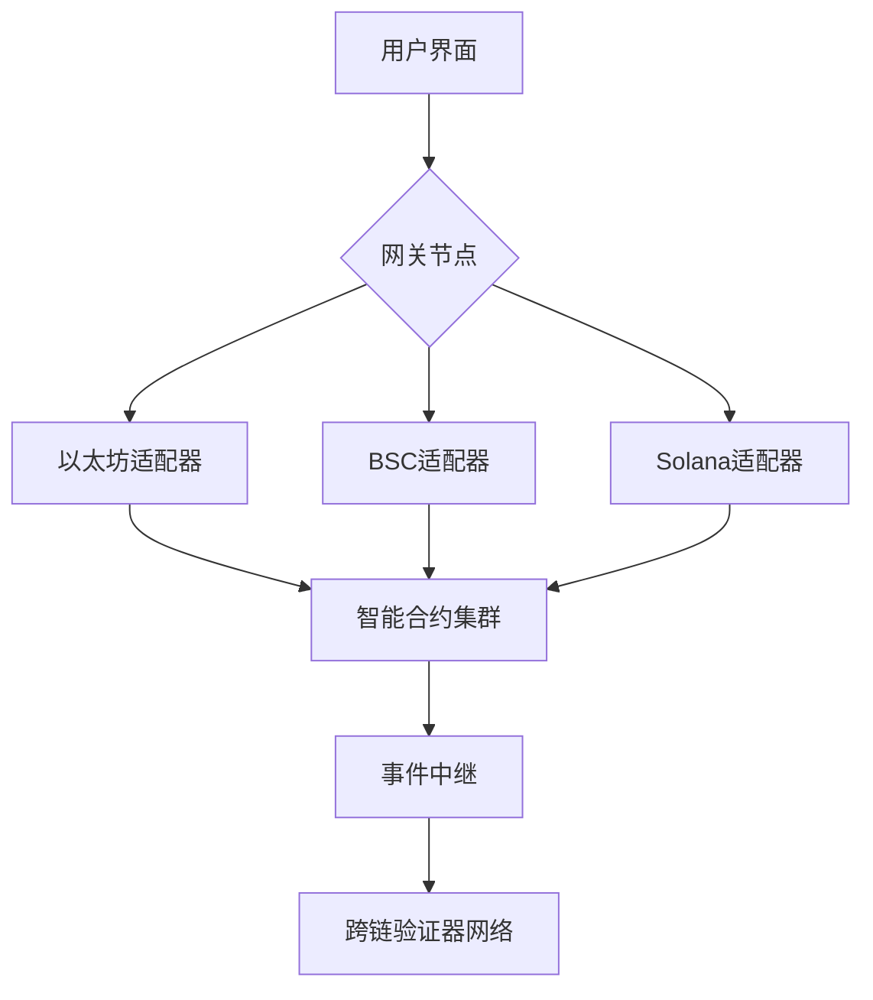

# MaskBTC
MaskBTC world mining pool for everyone not for whale
# Maskly Cross-Chain Bridge 

[](https://opensource.org/licenses/Apache-2.0)
[](https://soliditylang.org)
[](https://quantstamp.com)

下一代安全跨链资产桥接协议，支持以太坊、BSC、Solana等多链互操作

## 核心特性
- 🛡️ 量子安全签名算法（基于Lattice-based cryptography）
- 🌉 支持Lock-Mint和Liquidity Pool两种跨链模式
- 🔐 动态多签治理合约（阈值签名方案）
- 📱 集成生物识别认证的移动端应用
- 📊 实时跨链流动性监控仪表盘

## 技术架构


[详细架构设计](docs/TECHNICAL_DESIGN.md)

## 快速开始

### 环境要求
```bash
Node.js 18.x+
Docker 20.10+
Solidity 0.8.20
Hardhat 2.12.7
```

### 本地部署
```bash
# 克隆仓库
git clone https://github.com/maskly-project/maskly-bridge.git
cd maskly-bridge

# 安装依赖
npm install
npm run setup

# 启动测试网络
npx hardhat node

# 部署合约（新终端）
npx hardhat run scripts/deployment/deployBridge.js --network localhost
```

### 移动端构建
```bash
cd maskly/frontend/app
npm install

# Android
npx react-native run-android

# iOS
cd ios && pod install
npx react-native run-ios
```

## 安全审计
已通过第三方安全审计：
- [智能合约审计报告](security/audit/smart-contract-audit.pdf)
- [渗透测试报告](security/audit/pentest-report.pdf)

核心安全特性：
- 跨链交易阈值签名验证
- 实时异常交易检测系统
- 合约紧急暂停机制

## 项目结构
```
maskly/
├── blockchain/      # 智能合约
├── frontend/        # 前端应用
├── backend/         # 后端服务
├── security/        # 安全配置
├── scripts/         # 部署脚本
└── docs/            # 技术文档
```

## 贡献指南
欢迎通过GitHub Issue和Pull Request参与贡献。请遵循：
1. 提交前运行测试：`npm test`
2. 合约修改需通过Slither静态分析
3. 重大更改需提交RFC提案

## 许可证
Apache License 2.0 © 2025 Maskly Team
