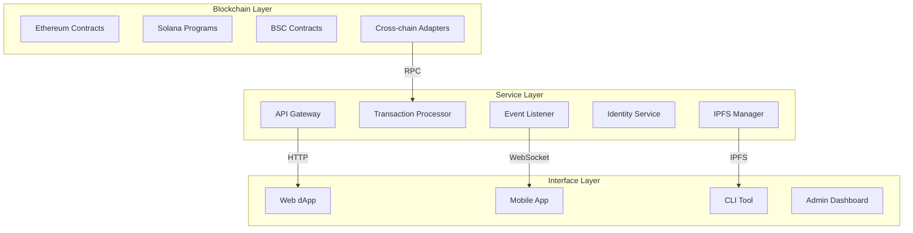
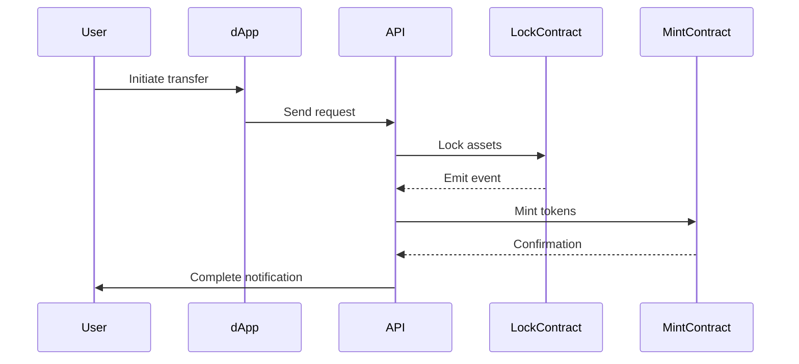
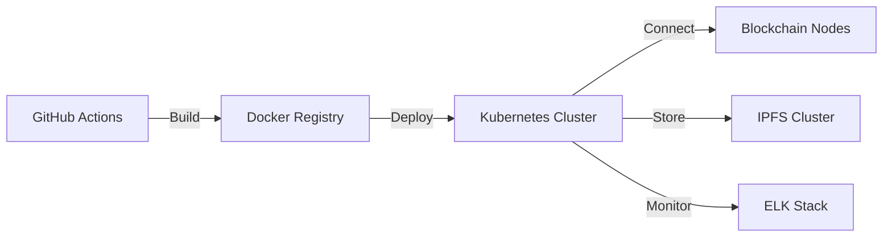

# Maskly Technical Architecture v2.0

## System Architecture

## Core Components

### 1. Blockchain Layer
- **Cross-chain Protocols**:
  - Lock-Mint: 
    - Ethereum: LockContract.sol
    - Solana: MintContract.rs
    - BSC: LockContract.sol
  - Liquidity Pool:
    - PoolManager.sol
    - Automated rebalancing algorithm

- **Governance**:
  - DAO.sol (Proposal management)
  - Voting.sol (Quadratic voting implementation)
  - ReferralRewards.sol

- **Security**:
  - QuantumResistantSignature.sol
  - MultiSig wallets
  - Oracle.sol (Price feeds)

### 2. Service Layer
| Service          | Technology       | Key Features                      |
|------------------|------------------|-----------------------------------|
| API Gateway      | Node.js + Express| Rate limiting, JWT authentication|
| Transaction Relay| Web3.js + ethers | Gas optimization, Nonce management|
| Event Processor  | RabbitMQ         | Smart contract event monitoring  |
| Identity Service | OAuth2 + ZK-SNARK| Biometric integration            |
| IPFS Manager     | js-ipfs          | Encrypted storage management     |

### 3. Interface Layer
- **Web dApp**:
  - React + TypeScript
  - WalletConnect integration
  - Real-time transaction tracking
  - Governance dashboard

- **Mobile App**:
  - React Native
  - WebRTC video chat
  - Face detection (OpenCV)
  - Biometric authentication

- **Admin Tools**:
  - Transaction monitoring
  - Smart contract upgrade management
  - Emergency pause controls

## Cross-chain Workflow

## Security Architecture
1. **Smart Contract**:
   - Slither static analysis
   - MythX vulnerability scanning
   - Formal verification for core contracts

2. **Network**:
   - TLS 1.3 encryption
   - IP whitelisting for RPC nodes
   - DDOS protection via Cloudflare

3. **Monitoring**:
   - Anomaly detection (Chainalysis)
   - Real-time alerting (Sentry)
   - Incident response playbook

4. **Key Management**:
   - HSMs for signing keys
   - Multi-party computation (MPC)
   - Biometric key derivation

## Technical Stack
| Category         | Technologies                          |
|------------------|---------------------------------------|
| Smart Contracts  | Solidity 0.8+, Anchor (Solana)        |
| Backend          | Node.js 18+, NestJS, TypeORM          |
| Frontend         | React 18+, Next.js, Tailwind CSS      |
| Mobile           | React Native 0.72+, WebRTC            |
| DevOps           | Docker, GitHub Actions, Terraform     |
| Testing          | Hardhat, Jest, Cypress                |
| Monitoring       | Prometheus, Grafana, Sentry           |
| Security         | Slither, Mythril, OWASP ZAP           |

## Deployment Architecture

## Future Roadmap
1. ZK-Rollup integration
2. Cross-chain NFT support
3. Decentralized identity federation
4. AI-driven threat detection
5. Layer 2 scaling solutions
